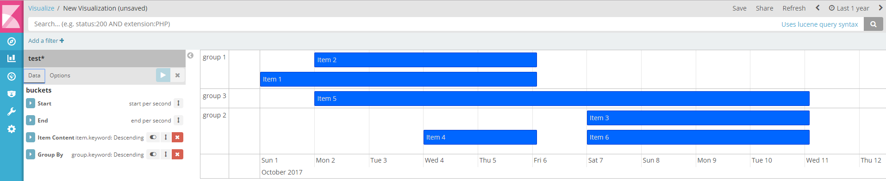

# kibana_vis_gantt
Kibana Plugin Gantt Chart



# Install
```
1. copy the gantt_vis folder into KIBANA_HOME/plugins
2. cd KIBANA_HOME/plugins/gannt_vis
3. npm install vis
```
Nodejs will add dependeces into folder node_modules inside of gannt_vis
```
  -- vis@4.21.0
  -- emitter-component@1.1.1
  -- hammerjs@2.0.8
  -- keycharm@0.2.0
  -- moment@2.19.1
  -- propagating-hammerjs@1.4.6
```

```
4. run kibana
```

# Offline-Install
```
1. copy the gantt_vis folder into KIBANA_HOME/plugins
2. copy node_modules folder from "offline" folder into KIBANA_HOME/plugins/gantt_vis
3. run kibana
```

# Re-Install
The plugin will be updated from time to time and if you would like to use new features you should reinstall/update plugin
```
1. cd KIBANA_HOME/plugins
2. rm gannt_vis -r
3. run kibana (wait until kibana optimize everithing)
4. stop kibana 
Now you can install new plugin:
5. copy the gantt_vis folder into KIBANA_HOME/plugins
6. cd KIBANA_HOME/plugins/gannt_vis
7. npm install vis
8. run kibana
```


# How to use
1. You should define start and end points. 
```
It is very important that you defined interval for both (start and end points) buckets! If your data defined in days then you should chouse days in interval. If your start and end timestamp is defined in seconds then you should chouse seconds!!! Otherwise aggregate Elastic your data.
```
2. Item is what will be shown in Gantt chart
3. GroupBy is group function

# Support
Kibana 5.6.x

# Based on
http://visjs.org/

